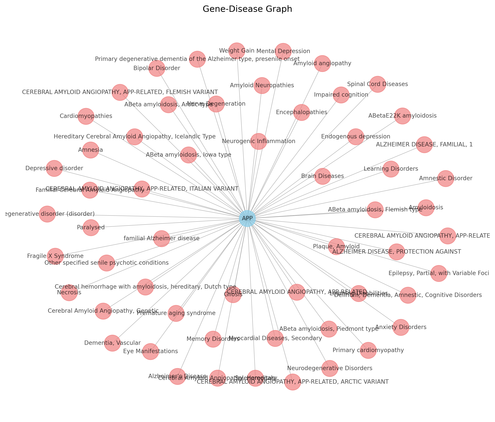
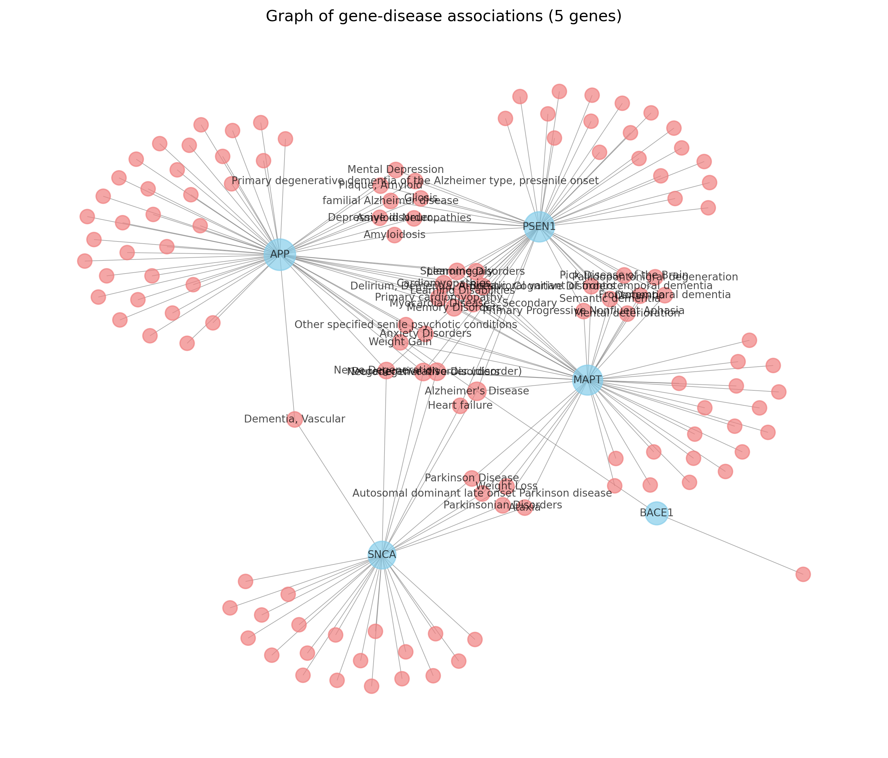
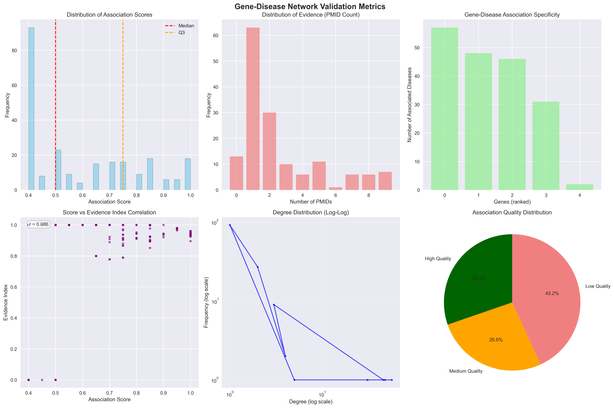

# 🧬 GenoTextLinker – Gene-Disease Knowledge Graph

> **GenoTextLinker** is a biomedical informatics project that builds a **gene–disease knowledge graph** using the [DisGeNET](https://www.disgenet.org/) API.  
> Its purpose is to transform raw associations into structured graphs, enabling researchers to explore, visualize, and analyze complex biological networks.  

---

## 🎯 Goal
Biomedical research produces vast amounts of scattered data. GenoTextLinker consolidates this information into a **graph-based representation**, making it easier to:  
- Discover new **biomarkers**.  
- Classify diseases based on genetic associations.  
- Explore community structures and gene–disease relationships.  
- Provide input for **Graph Neural Networks (GNNs)** and predictive modeling.  

---

## 🚀 What I Built
- **Data Retrieval & Processing**  
  - Fetches gene–disease associations from the DisGeNET API.  
  - Parses metadata: gene IDs, disease names, association scores, publication evidence.  

- **Graph Construction**  
  - Nodes = Genes / Diseases  
  - Edges = Associations (with confidence scores, evidence, publications).  
  - Export formats: CSV, JSON, GML.  

- **Validation & Statistics Module**  
  - Graph size: nodes, edges, raw associations.  
  - Association quality metrics (scores, evidence, PMID counts).  
  - Network topology (density, clustering coefficient, scale-free test).  
  - Community detection & modularity score.  

---

## 📊 Example Metrics (sample run)
- **Nodes**: 135  
- **Edges**: 184  
- **High-confidence links** (score ≥ 0.75): ✔  
- **Top disease cluster**: Alzheimer’s (multi-gene associations)  
- **Community modularity**: 0.46  

---

## 🛠️ Tech Stack
- **Language** → Python  
- **APIs** → DisGeNET REST API  
- **Libraries** → requests, JSON

---

## 📌 Use Cases
- 🔬 **Biomarker Discovery** – find genes central to multiple diseases.  
- 🧩 **Disease Classification** – cluster diseases by shared genetic links.  
- 🤖 **Graph-Based Learning** – use as input for GNNs or ML models.  
- 📊 **Visualization** – integrate with Cytoscape, Gephi, or dashboards.  

---

## 🎥 Demo

  
  
  

---

📌 **Repository link**: [Gene-Disease Graph](https://github.com/ArtigasChristopher/Gene-Disease-Graph)  
👤 **Author**: [Christopher Artigas](https://www.linkedin.com/in/christopher-artigas-fuentes/)  
📫 Contact: [Email](mailto:chrisartigas.ai@gmail.com) | [GitHub](https://github.com/ArtigasChristopher)
