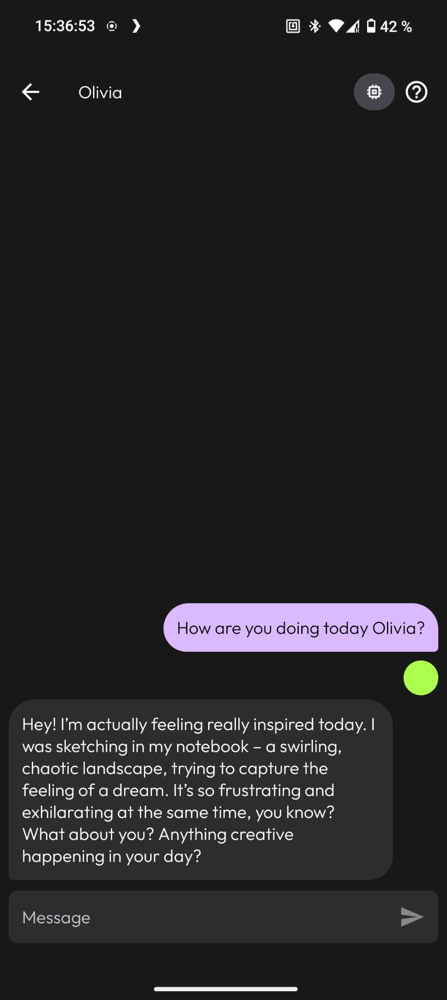
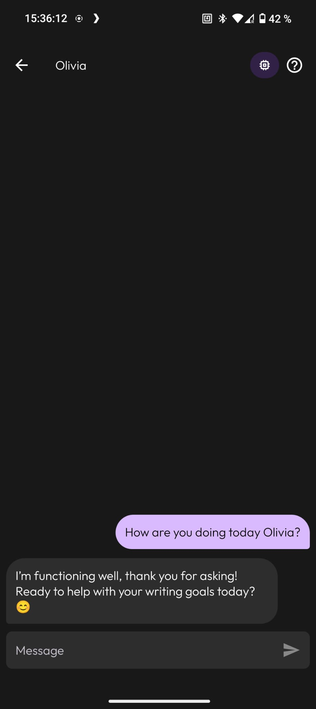
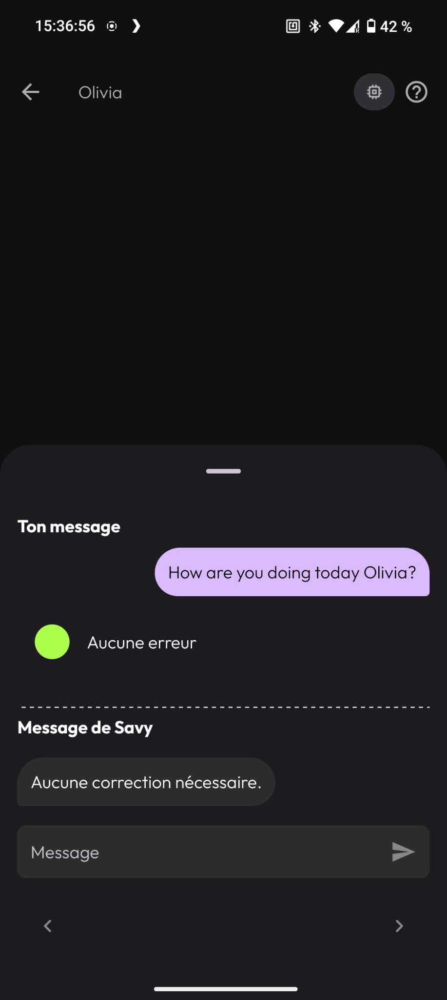
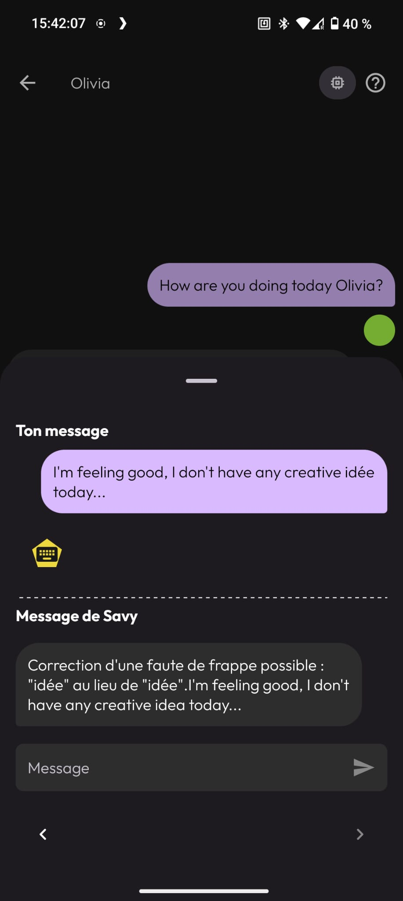
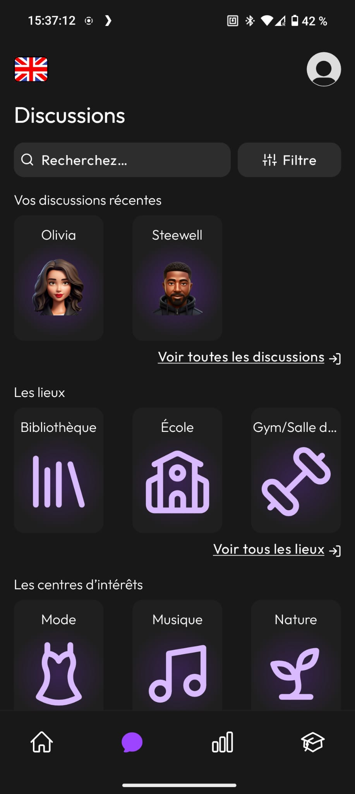

# 🌐 Savy – AI Language Learning App

> **Savy** is an AI-powered language learning app, incubated as an **EPITECH Innovative Project (EIP)**.  
> Our mission: revolutionize the way people learn languages by making it more **natural, interactive, and personalized**.

---

## 🎯 Goal
Most language learning apps focus on repetition and gamification.  
Savy takes another path: **conversational AI** that adapts to the learner’s style, corrects in real time, and works even **offline**.

---

## 🚀 What I Built

- **AI Discussion partener**
  - AI partener customs, adptating to user.
  - Protected by a moderation and anti-jailbreak pipeline.
  - Works in any language, and able to stick to a real-life scenario.

- **AI Corrector Pipeline**  
  - Multilingual grammar & style correction (English, Spanish, French, etc.).  
  - LLM-based phrasing suggestions for more natural sentences.  

- **On-Device Inference (Not public yet)**
  - Compact multilingual models running locally (<2GB RAM).  
  - Offline mode for corrections and text generation without internet.  

- **AI TTS & SST (Not public yet)**
  - A multilingual natural voice TTS pipleine for the AI discussion partener with low inference time.
  - A multilingual voice/accent analysis able to detect the errors of prononuncitation of a person speaking a non-native language, with feedbacks.

---

## 📊 Results
- Functional app successfully deployed during EIP, disponible in Android and iOS.
- Showed the feasibility of **offline AI for education**, a field where most competitors rely on cloud-only solutions. ( Not publicly deployed for now. )

---

## 🛠️ Tech Stack
- **Languages** → Python, Kotlin, C++
- **AI/ML** → PyTorch, Hugging Face Transformers, WhisperX, Ollama, Gemma
- **Mobile** → Jetpack Compose, llama.cpp (Android NDK build)  
- **Backend** → FastAPI, Docker  

---

## 🎥 Demo

  
  
  

  
  

---

## 📌 Next Steps
- Expand language coverage ( German, Italian, Korean, ...).  
- Optimize inference speed further for low-end devices.  
- Experiment with voice-based correction (ASR + TTS pipeline).

---

📲 **Savy**: [Website](https://savy-ai.com/)
👤 **AI-Head**: [Christopher Artigas](https://www.linkedin.com/in/christopher-artigas-fuentes/)
📫 Contact: [Email](mailto:chrisartigas.ai@gmail.com) | [GitHub](https://github.com/ArtigasChristopher)
